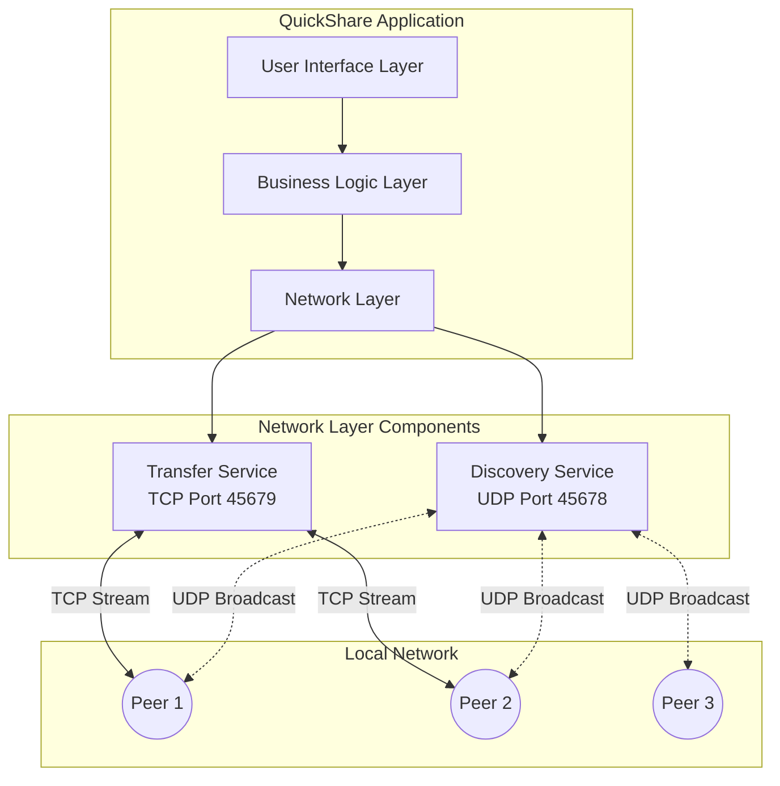
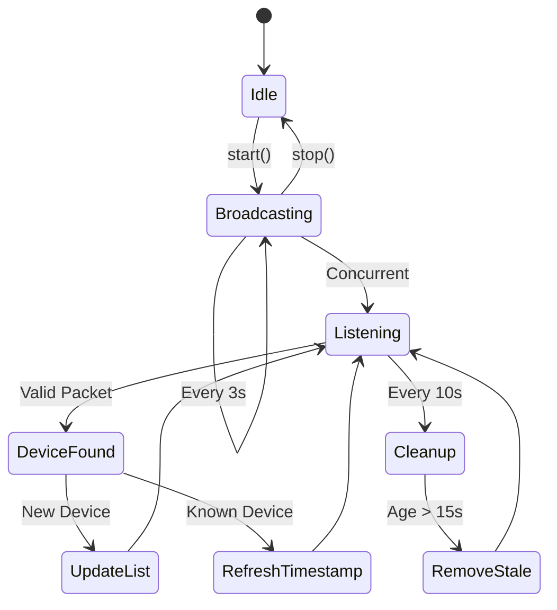
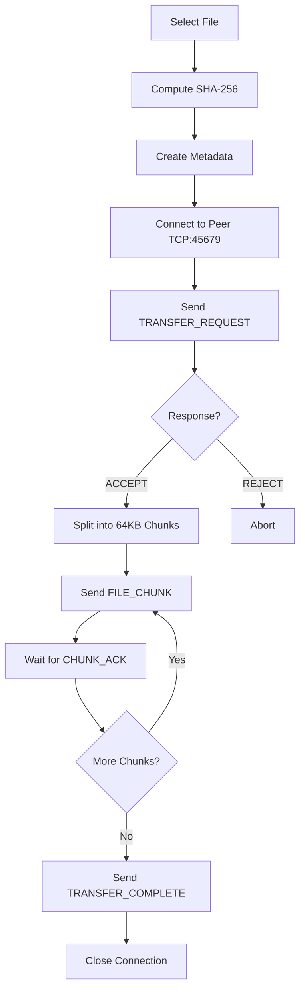
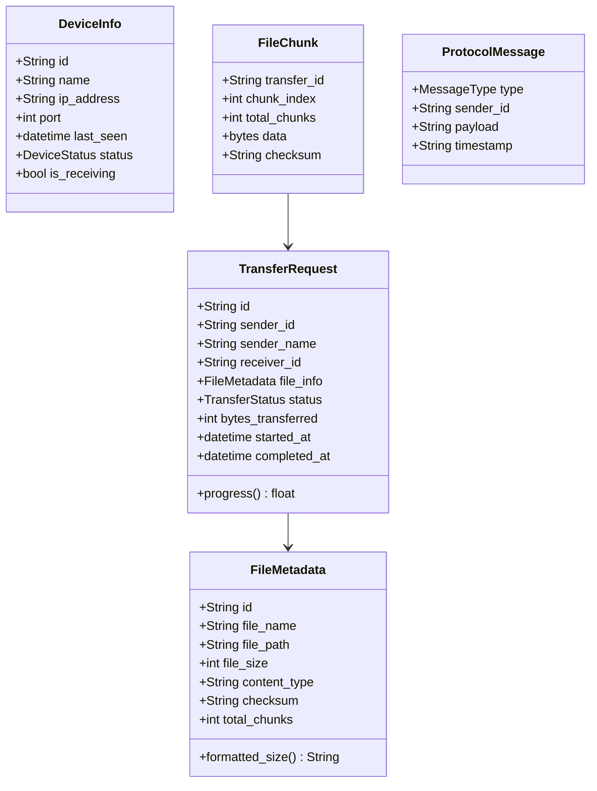
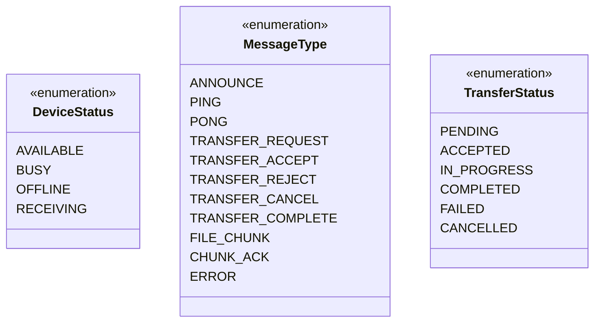
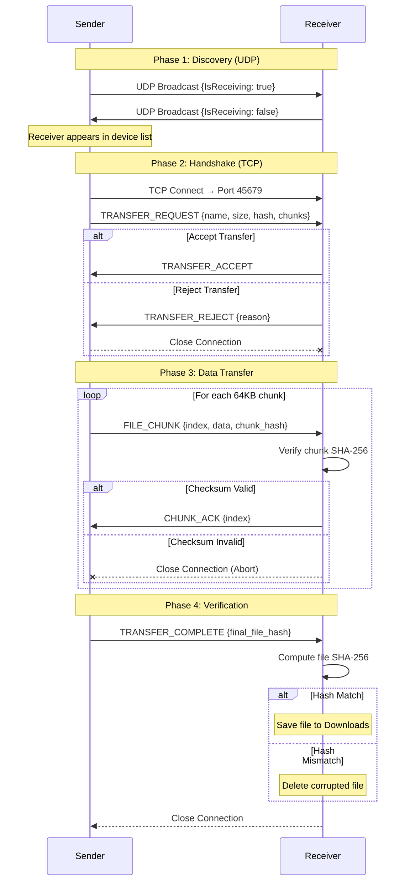

# QuickShare - Complete System Design Document

## 1. Executive Summary

**QuickShare** is a cross-platform desktop P2P file transfer application enabling direct file sharing between devices on a local network without internet connectivity or central servers.

| Aspect | Details |
|--------|---------|
| **Architecture** | Hybrid P2P (UDP Discovery + TCP Transfer) |
| **Technology** | Python 3.x, Tkinter, Socket Programming |
| **Discovery Port** | UDP 45678 |
| **Transfer Port** | TCP 45679 |
| **Chunk Size** | 64 KB |
| **Integrity** | SHA-256 Checksums |

---

## 2. System Architecture

### 2.1 High-Level Architecture Diagram



### 2.2 Layered Architecture

| Layer | Responsibility | Components |
|-------|---------------|------------|
| **Presentation** | User interaction, visual feedback | [QuickShareApp](file:///d:/P2P/quickshare.py#708-1140), Tkinter widgets |
| **Application** | Business logic, state management | Event handlers, callbacks |
| **Service** | Network operations | [DiscoveryService](file:///d:/P2P/quickshare.py#180-333), [FileTransferService](file:///d:/P2P/quickshare.py#336-705) |
| **Transport** | Raw network I/O | Python `socket` library |

---

## 3. Component Design

### 3.1 Discovery Service

**Purpose**: Automatic peer detection on local network.



**Key Attributes:**
| Attribute | Value |
|-----------|-------|
| Protocol | UDP |
| Port | 45678 |
| Broadcast Interval | 3000ms |
| Stale Threshold | 15 seconds |
| Message Format | JSON |

**Broadcast Packet Structure:**
```json
{
  "Service": "QUICKSHARE_V1",
  "Id": "A1B2C3D4E5F6",
  "Name": "LAPTOP-USER",
  "Ip": "192.168.1.105",
  "Port": 45679,
  "Timestamp": "2026-02-07T10:00:00Z",
  "IsReceiving": true
}
```

### 3.2 File Transfer Service

**Purpose**: Reliable file transmission with integrity verification.



**Key Attributes:**
| Attribute | Value |
|-----------|-------|
| Protocol | TCP |
| Port | 45679 |
| Chunk Size | 64 KB (65,536 bytes) |
| Buffer Size | 256 KB |
| Hash Algorithm | SHA-256 |
| Message Framing | Length-prefixed (4-byte header) |

### 3.3 User Interface

**Component Hierarchy:**
```
QuickShareApp (Root Window)
├── Left Panel (Device List)
│   ├── Header ("Devices" + Refresh Button)
│   └── Listbox (Scrollable device list)
├── Right Panel (Main Content)
│   ├── App Title & Device Info
│   ├── Drop Zone (File selection area)
│   ├── Progress Bar + Transfer Info
│   └── Control Buttons
│       ├── Receive Mode Toggle
│       ├── Open Downloads
│       └── Send File
└── Status Bar (Bottom)
```

---

## 4. Data Models

### 4.1 Class Diagram



### 4.2 Enumerations



---

## 5. Communication Protocol

### 5.1 Message Framing

All TCP messages use **length-prefixed framing**:

```
+----------------+------------------+
| Length (4B BE) | JSON Payload     |
+----------------+------------------+
```

- **Length**: 4-byte big-endian unsigned integer
- **Payload**: UTF-8 encoded JSON string

### 5.2 Protocol Messages

| Message Type | Direction | Payload | Purpose |
|-------------|-----------|---------|---------|
| `TRANSFER_REQUEST` | Sender → Receiver | FileMetadata JSON | Initiate transfer |
| `TRANSFER_ACCEPT` | Receiver → Sender | None | Confirm readiness |
| `TRANSFER_REJECT` | Receiver → Sender | Reason string | Decline transfer |
| `FILE_CHUNK` | Sender → Receiver | FileChunk JSON | Send data block |
| `CHUNK_ACK` | Receiver → Sender | Chunk index | Confirm receipt |
| `TRANSFER_COMPLETE` | Sender → Receiver | Final checksum | End transfer |

### 5.3 Complete Transfer Sequence



---

## 6. Threading Model

```mermaid
graph LR
    subgraph "Main Thread"
        UI[Tkinter Event Loop]
    end
    
    subgraph "Background Threads"
        T1[Broadcast Thread<br/>UDP Announcements]
        T2[Listen Thread<br/>UDP Reception]
        T3[Cleanup Thread<br/>Stale Device Removal]
        T4[Server Thread<br/>TCP Accept Loop]
        T5[Client Handler Thread<br/>Per-Connection]
        T6[Send Thread<br/>Per-Transfer]
    end
    
    UI -.->|root.after()| T1
    UI -.->|root.after()| T2
    UI -.->|Callbacks| T4
    T4 -->|Spawns| T5
    UI -->|send_file()| T6
```

**Thread Safety:**
- `threading.Lock` protects shared `discovered_devices` dictionary
- UI updates use `root.after(0, callback)` for thread-safe GUI modification

---

## 7. Network Configuration

### 7.1 Port Allocation

| Service | Protocol | Port | Direction |
|---------|----------|------|-----------|
| Discovery | UDP | 45678 | Bidirectional Broadcast |
| Transfer | TCP | 45679 | Inbound (Server) + Outbound (Client) |

### 7.2 Socket Options

| Option | Value | Purpose |
|--------|-------|---------|
| `SO_REUSEADDR` | 1 | Allow port reuse after restart |
| `SO_BROADCAST` | 1 | Enable UDP broadcast |
| `SO_SNDBUF` | 256KB | Increase send buffer |
| `SO_RCVBUF` | 256KB | Increase receive buffer |
| Timeout | 1.0s | Non-blocking operations |

---

## 8. Security Analysis

### 8.1 Current Security Model

| Aspect | Status | Risk Level |
|--------|--------|------------|
| **Encryption** | ❌ None | High |
| **Authentication** | ❌ None | High |
| **Authorization** | ❌ None | Medium |
| **Integrity** | ✅ SHA-256 | Low |

### 8.2 Threat Model

| Threat | Impact | Mitigation |
|--------|--------|------------|
| Eavesdropping | Data exposure | Future: TLS encryption |
| Spoofing | Impersonation | Future: Device pairing/PIN |
| Man-in-the-Middle | Data tampering | SHA-256 detects corruption |
| DoS | Service unavailable | Rate limiting, connection limits |

---

## 9. Error Handling

| Scenario | Handler | Action |
|----------|---------|--------|
| Network timeout | `socket.timeout` | Retry or skip |
| Connection refused | `ConnectionError` | Mark device offline |
| Checksum mismatch | Runtime check | Abort transfer, notify user |
| File not found | `os.path.exists` | Show error dialog |
| Disk full | `IOError` | Abort, cleanup partial file |

---

## 10. Performance Considerations

| Metric | Current | Optimization |
|--------|---------|--------------|
| Chunk Size | 64 KB | Tunable for different networks |
| Buffer Size | 256 KB | Larger for high-speed LAN |
| Broadcast Interval | 3s | Balance discovery vs overhead |
| Concurrent Transfers | Unlimited | Could add connection pooling |

---

## 11. Future Enhancements

1. **Security**: TLS encryption, device pairing with PIN
2. **Reliability**: Resume interrupted transfers, retry failed chunks
3. **Performance**: Compression (zlib/lz4), parallel chunk transfer
4. **Features**: Folder transfer, transfer queue, transfer history
5. **Cross-Platform**: Web UI, mobile companion app
